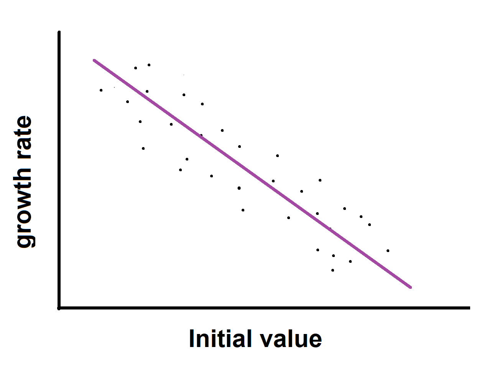
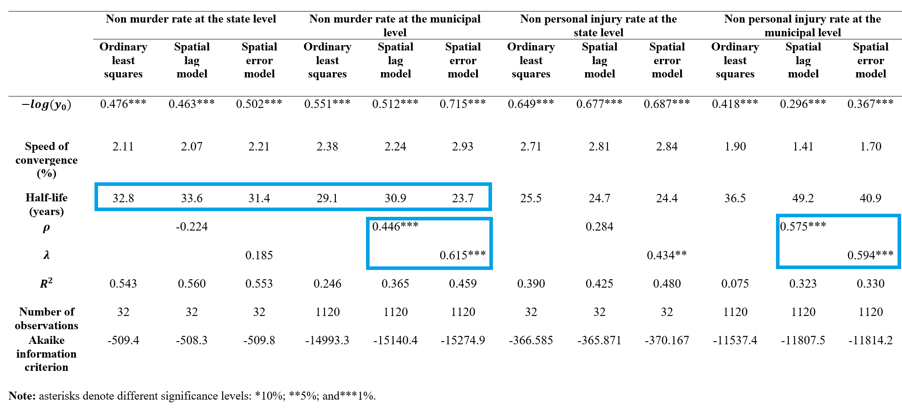
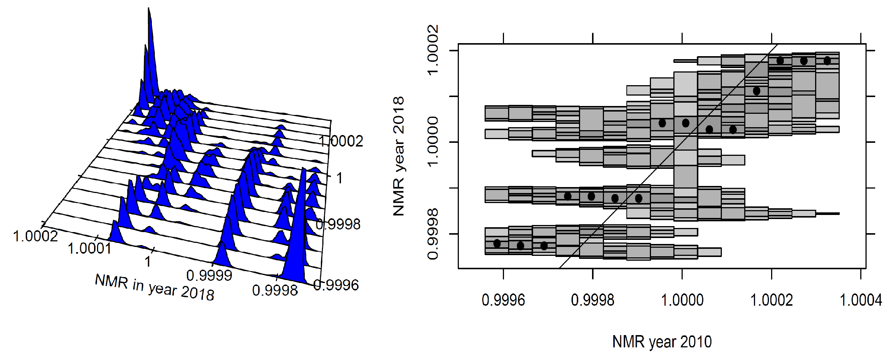
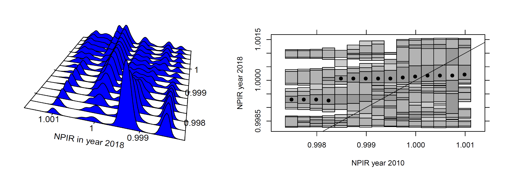
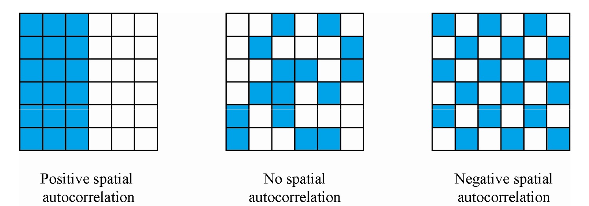
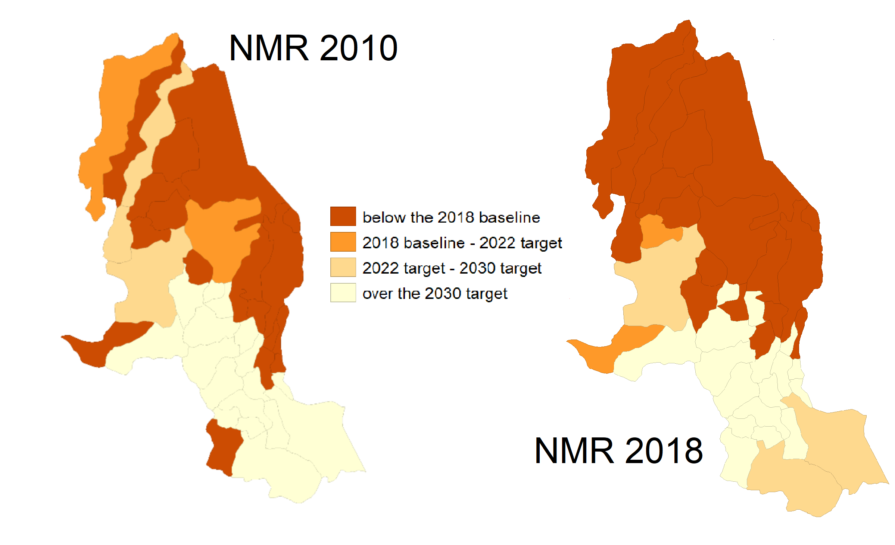

```{r setup, include=FALSE}
library(xaringan)
options(htmltools.dir.version = FALSE)
```


## Motivation:

- Beyond GDP, socio-economic variables and their convergence are relevant for development studies (Royuela et al 2015)

- Persistent income differences, differences in health indicators and in "general" regional inequality in Colombia.

- Scarce academic literature on convergence at the municipal level. 
  
## Research Objective:
  
- Study convergence/divergence of homicide rates (**NMR**) and personal injury rates (**NPIR**) across municipalities and departments in Colombia over 2010-2018. 

- Analyze spatial autocorrelation and its robustness at different disaggregation levels.
  
## Methods:

- Classical convergence framework (Barro and Sala-i-Martin 1992)

- Distributional convergence framework (Quah 1996; Hyndman et. al 1996)

- Spatial convergence (spatial lag and spatial error models)

- Spatial autocorrelation (Moran's I and differential Moran's I)

---

class: middle

# Main Results:

1. **Sigma Convergence** for both homicide and personal injury rates at the state level, **Beta Convergence** for both levels and rates.

3. **Clustering dynamics** 

  - NMR State level: 4+? convergence clusters
  - NMR Municipal level: 2+? convergence clusters
  - NPIR State level: 2 convergence clubs
  - NPIR Municipal level: stagnation and 2 convergence clubs

4. **Spatial Autocorrelation** robust only  at the municipality level
  

---

class: middle

# Outline of this presentation

1. **Data description** Non crime rates

2. **Global convergence:** Using classical summary measures

  - Beta convergence 
  - Sigma convergence 

3. **Regional disaggregation:** 

  - Distribution dynamics framework
  - Distributional convergence

4. **Global spatial autocorrelation:**

  - Disaggreagation effects
  
5. **Policy discussion**

  - The Colombian National Development Plan
 2018-22  
  
5. **Concluding Remarks**
  
---

class: middle

# (1) Data:

- Total number of **homicides** and **personal injuries** in Colombia per year from 2010 until 2018 (data taken from the national police).

- Data is agreggated at the municipal  and departmental levels.

- Population census and estimates for states and municipalities (data from the National Bureau of Statistics).

- Raw rates computed $$raw\space rates = crimes / population$$

- Non crime rates  computed　
   $$NCR= 10000- raw\ rate * 10000$$
- **Survival rates** are chosen because positively defined variables are a **standard** in the convergence literature. 
---

class: middle,center

## Non-crime variables over time


---

class: center, middle

# (2) **Global convergence:**

**Beta convergence** (catch-up process)         $log{\frac{Y_{iT}}{Y_{i0}}}=\alpha +\beta \cdot log(Y_{i0})+ \epsilon$



**Spatial Beta models**
 
*Spatial lag Model:*　 　　 $\log \frac{Y_{i T}}{Y_{i 0}}=\alpha+\beta \cdot \log \left(Y_{i 0}\right)+\rho W \log \frac{Y_{i T}}{Y_{i 0}}+\varepsilon_{t}$

*Spatial Error Model:*         　　　　 　   $\log \frac{Y_{i T}}{Y_{i 0}}=\alpha+\beta \cdot \log \left(Y_{i 0}\right)+\lambda W \varepsilon_{t}+u_{t}$

**Sigma convergence** (the dispersion of the data decreases over time)


---
class: middle, center

# Classical Convergence results (NMR)

.pull-left[

##States- Sigma and Beta convergence 


]

.pull-right[

## Municipalities - ONLY Beta convergence


]

**Sigma convergence results** 


---
class: justify

## Beta and sigma  convergence summary




- **Lagrange multiplier tests** also indicate that the SEM is the best fitting model.
-  Royuela and García (2015) also reported that the $\rho$ and $\lambda$ coefficients  were **NOT significant at the state level** over the period 1990 to 2005.  
- The authors reported half-lives of **15.3, 11.5 and 15.8 years**. 


---

class: center, middle

# (3) **State and Municipality disaggregation:** 

## The distribution dynamics framework


---

class: center, middle

## The distribution dynamics framework
## Convergence, divergence and stagnation


---
class: middle, center

# (3) Local convergence clusters

**NMR State level**: 4+? convergence clusters

**NMR Municipal level**: 2+? convergence clusters

**NPIR State level **: 2 convergence clubs

**NPIR Municipal level **: stagnation and 2 convergence clubs

---
class: middle, center
##NMR at both levels

 State level: 4+? convergence clusters
 
 


Municipal level: 2+? convergence clusters


## At the municipal level there are fewer clusters but no signs of sigma convergence

---
class: middle, center

##NPIR at both levels

 State level: 2 convergence clusters
 
 


Municipal level: 2 convergence clusters and stagnation


## the same number of clusters but stagnation patterns are strong at the municipal level.

---
class: middle, center

# (4) Spatial Autocorrelation (Theory)

##**High Intuition Concept**   




## More Formal (less intuitive)

$$I = \frac{\sum_i\sum_j w_{ij} y_i.y_j}{\sum_i y_i^2} = \frac{\sum_i (y_i \times \sum_j w_{ij} y_j)}{\sum_i y_i^2}.$$

##Differential Moran's I ( $y_{i,t}−y_{i,t−1}$ )
We compute the Moran's I  for the  variable 
$y_{i,t}−y_{i,t−1}$. 

If there is a  fixed effect  $\mu_i$ related to location $i$, it is possible to present the value at each location for time $t$ as the sum of some intrinsic value and the fixed effect. $y_{i,t} = y*_{i,t} + \mu_i$ 


---
class: justify

# (4) Spatial autocorrelation  (Results)

- **State level**: Moran's I statistic is significant, differential Moran's I is not significant (**not robust**)

- **Municipal level**: Standard and Differential Moran's I significant  (**robust**)
- **Space matters at the Municipal level**

<br />


---


#(5) Policy discussion 

- Vertical and horizontal policy coordination, spillovers and borders.

- Spatial spillovers from neighbors can have **both positive and negative effects** on the convergence path of a region.

- It could be more appropriate for the formulation of national development plans to have targets at the state level
 

---

# (5) Concluding Remarks

## Uplifting results "on average" :

- The dispersion of non-crime (crime) rates at the state level **has decreased**. On average less homicides but more personal injuries. 

- **Global convergence on average at the state level**, while fast beta convergence at the municipality level.

## Beyond classical convergence  :

- Regional differences matter in **both disaggregation levels**.

- **Multiple local convergence clubs**; with more clubs at the state level.

## The Role of Space

- Subsequent Differential Moran's I are robust and significant at the **municipality level only**

- Results at the **state level** for NMR are not conclusive and similar to the ones reported by Royuela et al 2015.

---

# (5) Concluding Remarks

# Implications and further research

- Convergence clusters help us to find regions with similar outcomes, coordination among them can be promoted.

- Strong spatial autocorrelation suggest the possibility of applying spatial filters in order to remove the spatial component of crime variables.  

- At the state level (including more variables) a probit model may help us to find the determinants for a conditional "jump" to the upper clusters.

- As many municipalities have small population, crime rates have high  variance instability. Empirical Bayes methods can be used. 
---
class: center, middle

# Thank you very much for your attention

 You can find the working paper on my website https://felipe-santos.rbind.io

If you are interested in our research please check our QuaRCS lab website <br />
https://quarcs-lab.rbind.io/

 

**Quantitative Regional and Computational Science Lab**


